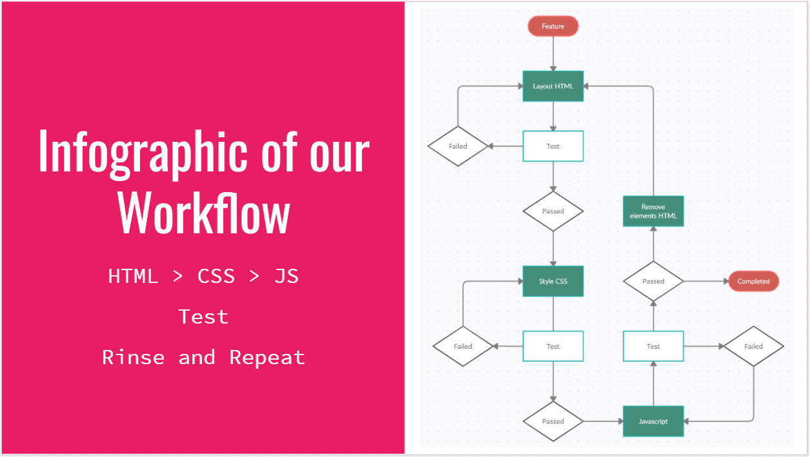

# Expedition Appetite

**Expedition Appetite** is an application a user would use to get travel details/directions and find nearby food options like restaurants, near their destination. The user would first enter their **travel details** and tell us what **type of food** they were interested in. Then we would return back their travel details from a Google API and restaurant details from the Yelp API.

Now the user has their travel itinerary and options for places to eat!

Please visit our page: [Expedition Appetite](https://serenachandler.github.io/Project1/)


## Project Objective

This project is a group assignment which included the team members **Jake Novelli**, **Cheng Tang**,and **Serena Chandler**. The project idea was open to us to come up with but we had certain restrictions and limitations to abide by.

-   Use a `framework` other than **Bootstrap**
-   Webpage had to be interactive
-   User `validation` was needed
-   Use at least two `server-side API's` we had not used before
-   Use `<modal>`s in place of `alert`s, `confirm`s, or `prompt`s
-   Use a new library
-   Use client-side storage
-   Be responsive
<br>
This offered us a challenge but also freedom to research and decide on technologies we were interested in learning.


## User Stories

Here are the User Stories we used to create our application.


## Wireframe vs Final Product

We started with a general idea of the page layout knowing that we would need:
1. A `<form>` for user input
2. A `<modal>` for user validation
3. Several `<button>` for previous search history
4. A `<div>` for the travel details
5. A `<div>` for the food details


## Technologies & Features Used

Here are the technologies we used in our application. Further below we'll go into details about why and how we used it.
1. [Materialize CSS](https://materializecss.com/)
2. [jQuery](https://jquery.com/)
3. [SweetAlert.js](https://sweetalert.js.org/)
<br>

### Materialize CSS

We decided to use Materialize CSS for our framework due to the design language/styling, the simplicity of their documentation, and the ease of implementating their features.

Below are the features we used within our application:

<hr>

**Carousel & Parallax**

We wanted to inspire our visitors with food options as soon as they landed on the page. This was a great opportunity to use the **carousel** feature from Materialize CSS. We also wanted to use the **parallax** feature and simple enough we just had to add it as a class and it would give the image the **parallax** effect so we used it in conjunction with the **carousel**. Another additional feature that the `class="carousel-slider"` we also used was full width and mobile ready.

```
<div class="container">
    <div class="carousel carousel-slider parallax-container" style="max-height:600px">
        <a class="carousel-item responsive-img parallax" href="#one!"></a>
        <a class="carousel-item responsive-img parallax" href="#two!"></a>
        <a class="carousel-item responsive-img parallax" href="#three!"></a>
    </div>
```

<br>

**Media breakpoints**

Materialize CSS made has a get structure for their page layout and made it easy to implement **media breakpoints**

In our application, we employed 2 different breakpoints:
    - Medium - 33%
    - Small - 100%

Below is a sample of our code and how our application looks when resized:

```
<div class="row">
            <div id="searchArea" class="col s12 m4 l4 white-text">
                <h3>Search Area</h3>
                <form>
                    <div class="input-field">
                        <input class="originCity white-text" type="text" placeholder="Origin City">
                        <label for="origin-city"></label>
                    </div>
```

<br>

**Collapsible**

The **collapsible** feature was used in the Yelp API response to show details of the restaurants neare their destination. A nice option of this feature was adding the `class="active` on one the first element that way we could signal to the user that there is content inside of these elements and that they should click on them.

```
        <!-- COLLAPSIBLE CONTAINER FOR RESTAURANT SEARCH RESULTS -->
        <ul id="foodContainer" class="collapsible">
            <!-- JAVASCRIPT WILL RENDER UPON USER SEARCH -->
            <li class="active">
                <div class="collapsible-header"><i class="material-icons" style="color: #FC90A4;">push_pin</i>Name of Restaurant</div>
                <div class="collapsible-body row">
                    <div class="col s12 m4">
                        
                    </div>
                    <div id="restDetails1" class="col s12 m8">
                        <p class="flow-text">Address</p>
                        <p class="flow-text">$$$</p>
                        <p class="flow-text">Rating</p>
                        <a class="flow-text" target="_blank" href="https://www.yelp.com">Visit</a>
                    </div>
                </div>
            </li>
```

<br>

### Javascript Libraries

**jQuery**

This is the built in library that offers a simplified version of methods and selectors. jQuery breaks all of the elongated 
text into small methods. jQuery helps your code look clean and compact, rather than having a bulk of words. A widely known
symbol for jQuery is the "$" selector. Here are a few examples of jQuery being used below in our code:


<br>

**Sweet Alerts**

Otherwise known as "sweetalerts.js" is the second library we chose to use for our modals. Sweet alerts offers a relatively
simple and easy to use method that will display modals when called upon in a function. You are able to customize the pop-up
with Icons, Titles, Text and Buttons. Here is an example of how we used Sweet Alerts on our website:


<br>

## API Used

The API's we used for this project are:
    1. Google Maps API
    2. Yelp Business API

First step of using Web API's is to formulate a request in Javascript. To do that, we used the method "AJAX". We will pull
the input values the user entered on the website, then push those values as parameters through AJAX to the Web API. 
The API will then respond to our request with an OK or denying our response. To make sure our request is OK, we need to
attach an API key on API's that require them. Once we recieve the ok, we can then mainpulate through the response 
and append the results the user wanted to our page! Below are some brief examples of what the request and response looked
like for both:


## Deployed Link

Please visit our page: [Expedition Appetite](https://serenachandler.github.io/Project1/)


## Future Development

These are the features we wanted to implement but as we focused on our MVP these moved to future development considerations.

- Implement a map with directions.
- Implement other modes(Walking, Biking, Flying).
- Dynamic Photos from Yelp.
- Current Location.
- Create multiple stops before ending destination.

## Contributors
**LinkedIn Profile**
- [Jake Novelli's LinkedIn Profile](https://www.linkedin.com/in/david-jacob-novelli/)
- [Cheng Tang's LinkedIn Profile](https://www.linkedin.com/in/cheng-tang-0663211a3/)
- [Serena Chandler's LinkdedIn Profile]()
<br>

**GitHub Profile**
- [Jake Novelli's GitHub](https://github.com/dnovelli1)
- [Cheng Tang's GitHub](https://github.com/cheng21tang)
- [Serena Chandler's GitHub]()


## Workflow Structure

Here is just a simple representation of our workflow:



### License

This project is licensed under the MIT License.


### Acknowledgements
